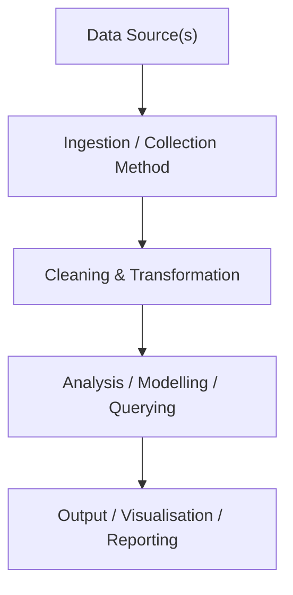

# Customer Lifetime Value (CLV) Analysis

---

## ⚙️ Project Type Flags

- [x] Exploratory Data Analysis (EDA)
- [ ] SQL Analysis / Querying
- [x] Dashboard / Data Visualization
- [ ] Data Pipeline / ETL
- [ ] Predictive Modelling / Machine Learning
- [x] Data Cleaning / Wrangling
- [ ] End-to-End (multiple of the above)
- [ ] Other: ___________

---

## Table of Contents
- [Customer Lifetime Value (CLV) Analysis](#customer-lifetime-value-clv-analysis)
  - [⚙️ Project Type Flags](#️-project-type-flags)
  - [Table of Contents](#table-of-contents)
  - [1. Project Overview](#1-project-overview)
  - [2. Objectives](#2-objectives)
  - [3. Project Scope \& Tools](#3-project-scope--tools)
    - [Scope](#scope)
    - [Tools \& Technologies](#tools--technologies)
  - [4. Repository Structure](#4-repository-structure)
  - [5. Data Workflow](#5-data-workflow)
  - [6. Data Model \& Schema](#6-data-model--schema)
    - [Dataset / Table: `df_raw.csv` / `df_clean.csv`](#dataset--table-df_rawcsv--df_cleancsv)
  - [7. Analysis \& Metrics](#7-analysis--metrics)
    - [Analytical Approach](#analytical-approach)
    - [Key Metrics Defined](#key-metrics-defined)
    - [Methods Used](#methods-used)
  - [8. Key Insights](#8-key-insights)
  - [9. Recommendations](#9-recommendations)
  - [10. Assumptions \& Limitations](#10-assumptions--limitations)
    - [Assumptions](#assumptions)
    - [Limitations](#limitations)
  - [11. Future Enhancements](#11-future-enhancements)
  - [12. Deliverables](#12-deliverables)
  - [13. Author](#13-author)

---

## 1. Project Overview

**Context:**<br> A UK-based online retail business sells thousands of unique gift and home goods items globally, with the majority of its customer base concentrated in the UK. Revenue data was available at the transaction level, but the business lacked a systematic view of which customers, products, and markets were actually driving profit.

**Problem Statement:**<br> Without a structured understanding of Customer Lifetime Value, marketing spend was distributed roughly evenly across segments despite dramatically different customer behaviours — and operational risks like high international cancellation rates were invisible in aggregate reporting.

**Approach:**<br> Transaction data spanning ~541,900 rows was cleaned, transformed, and explored using Python. CLV was calculated per customer using a formula combining Average Order Value, Purchase Frequency, Churn Rate, and an assumed Profit Margin. Customers were then segmented by spend tier, and geographic and seasonal patterns were analysed to surface operational risk.

**Outcome:**<br> The analysis identified three distinct customer value segments, flagged disproportionate cancellation leaks in Portugal and Ireland, confirmed aggressive Q4 seasonality as an operational stress point, and produced four data-backed business recommendations with clear ownership.

---

## 2. Objectives

- **Primary Objective:**<br> Calculate Customer Lifetime Value (CLV) for each customer and segment the customer base by value tier to guide marketing investment decisions.
- **Secondary Objective 1:**<br> Identify geographic markets with high cancellation rates and quantify their revenue risk.
- **Secondary Objective 2:**<br> Analyse monthly sales and cancellation seasonality to uncover operational strain during peak periods.
- **Secondary Objective 3:**<br> Identify top-performing products by sales volume and revenue to prioritise marketing spend.

---

## 3. Project Scope & Tools

### Scope

| Dimension | Details |
|-----------|---------|
| **In Scope** | Transaction-level e-commerce data; all countries; all product categories; CLV, segmentation, geographic, seasonal, and product analyses |
| **Out of Scope** | Customer demographic data, marketing spend data, and supplier/cost data — none of which were present in the source dataset |
| **Time Period** | December 2010 – December 2011 (approx. 13 months) |
| **Granularity** | Individual transaction rows; aggregated to customer-level for CLV; daily and monthly for time series |

### Tools & Technologies

| Category | Tool(s) Used |
|----------|-------------|
| Data Storage | CSV files (`data/raw/`, `data/processed/`) |
| Data Processing | Python 3.13, pandas, numpy |
| Analysis | pandas (aggregation, groupby, segmentation), custom CLV formula |
| Visualization | Matplotlib, Seaborn |
| Path Handling | pathlib |
| Version Control | Git / GitHub |
| Documentation | Markdown |

---

## 4. Repository Structure

```
CLV-business-analysis/
│
├── data/
│   ├── raw/                  # Original, unmodified source data — never edited
│   │   └── df_raw.csv
│   └── processed/            # Cleaned and transformed data
│       └── df_clean.csv
│
├── notebooks/
│   └── main.ipynb            # End-to-end analysis: Prepare → Process → Analyse → Share → Act
│
├── pyproject.toml            # Project metadata and Python dependencies (managed via uv)
└── README.md                 # You are here
```

---

## 5. Data Workflow



1. **Source:** <br>Single CSV export from a UK-based e-commerce platform (~45 MB raw). Data includes invoice-level records for all transactions, including cancellations, across 38 countries.
2. **Ingestion:** <br>Loaded with `pandas.read_csv()` using `ISO-8859-1` encoding to handle special characters in product descriptions. Raw data was never modified.
3. **Cleaning:** <br>Removed 24.93% of rows with missing `CustomerID` (these rows cannot be attributed to a customer, making CLV calculation impossible). Removed rows with missing `Description`. Dropped duplicate rows. Converted `InvoiceDate` from string to datetime and `CustomerID` from float to integer. Filtered out cancellation transactions (`InvoiceNo` starting with `'C'`) from the main analysis dataset.
4. **Transformation:** <br>Derived a `total_purchase` field (`UnitPrice × Quantity`). Aggregated to customer level: total spend, transaction count, first-to-last active span in days, and average order value. Applied `pd.cut()` to create three spend-tier segments. Extracted month name and date dimensions for seasonality analysis.
5. **Analysis:** <br>Calculated CLV per customer using the formula below. Performed customer segmentation, geographic revenue and cancellation comparison, daily and monthly time series analysis, and product-level sales ranking.
6. **Output:** <br>Annotated `main.ipynb` notebook containing all code, charts, and commentary; cleaned CSV saved to `data/processed/df_clean.csv`.

---

## 6. Data Model & Schema

### Dataset / Table: `df_raw.csv` / `df_clean.csv`

| Field Name | Data Type | Description | Example Value |
|------------|-----------|-------------|---------------|
| `InvoiceNo` | string | Unique invoice identifier. Prefix `'C'` indicates a cancellation. | `536365`, `C536379` |
| `StockCode` | string | Unique product/stock identifier | `85123A` |
| `Description` | string | Plain-text product name | `WHITE HANGING HEART T-LIGHT HOLDER` |
| `Quantity` | int | Number of units in the transaction (negative for cancellations) | `6` |
| `InvoiceDate` | datetime | Date and time the invoice was raised | `2010-12-01 08:26:00` |
| `UnitPrice` | float | Price per unit in GBP (£) | `2.55` |
| `CustomerID` | int | Unique customer identifier (nullable in raw data) | `17850` |
| `Country` | string | Country the customer is based in | `United Kingdom` |

> **Row count (raw):** 541,909 rows  
> **Row count (clean, after removing nulls, duplicates, cancellations):** ~397,884 rows (approx.)  
> **Date range:** December 2010 – December 2011  
> **Key derived field:** `total_purchase = UnitPrice × Quantity`

---

## 7. Analysis & Metrics

### Analytical Approach

This project is primarily **exploratory** in nature. There was no pre-specified hypothesis to prove or disprove; instead, the analysis progressively built a picture of customer value and operational risk from the bottom up. CLV was calculated using a deterministic formula (not a predictive model) as a structured way to rank and segment customers. All other analyses — geographic, seasonal, and product-level — were designed to contextualise and validate the CLV findings.

The notebook follows the **Ask → Prepare → Process → Analyse → Share → Act** framework, with a dedicated section for business communication (Share) and actionable recommendations (Act).

### Key Metrics Defined

| Metric | Plain-Language Definition | Why It Matters |
|--------|--------------------------|----------------|
| `avg_order_value` | Total revenue from a customer divided by their number of transactions | Measures how much a customer spends per visit — a key driver of CLV |
| `purchase_frequency` | Total transactions across all customers divided by number of unique customers | Captures how often the average customer buys; higher frequency = higher CLV |
| `repeat_rate` | Proportion of customers who made 2 or more purchases | Signals customer loyalty; this dataset showed a 98.34% repeat rate |
| `churn_rate` | 1 − Repeat Rate | The "one-and-done" rate — what fraction of customers never returned (1.66%) |
| `CLV` | `((avg_order_value × purchase_frequency) / churn_rate) × profit_margin` | The estimated total value a customer brings over their lifetime — used to rank and segment customers |
| `total_purchase` | `UnitPrice × Quantity`, summed per customer | The raw revenue contributed by a customer; used for segmentation thresholds |
| `cancellation_rate` | Share of invoices beginning with `'C'` by country | Highlights operational leakage — markets where revenue is being reversed post-sale |

### Methods Used

- **CLV formula:** Custom deterministic calculation combining average order value, purchase frequency, churn rate, and assumed profit margin (10%)
- **Customer segmentation:** Spend-tier binning using `pd.cut()` — Low (< £1,500), Medium (£1,500–£3,500), High (> £3,500)
- **Geographic comparison:** Grouped revenue and cancellation counts by country; identified outliers in cancellation share relative to customer volume
- **Time series analysis:** Daily order counts and monthly total purchase aggregations to identify seasonality
- **Product analysis:** Frequency counts of `StockCode` and `Description`; revenue ranking by `total_purchase` at product level

---

## 8. Key Insights

**Insight 1: A tiny customer segment generates a disproportionate share of revenue**  
After segmentation, "High Purchase" customers (total spend > £3,500) represent a small fraction of the customer base but account for the majority of revenue. CLV across segments varies by roughly 5×. This means evenly distributed marketing spend is structurally inefficient — money spent acquiring or retaining low-CLV customers delivers far lower returns than equivalent spend on the high-value segment.

**Insight 2: Repeat rate is near-perfect — but that masks a one-time buyer problem**  
The 98.34% repeat rate sounds impressive, but it reflects the dataset's limited 13-month window; many apparent "repeat buyers" may simply have been captured across multiple invoices in the same session. The 1.66% churn rate (the "one-and-done" rate) should be monitored monthly to detect deterioration. It is not safe to assume this will hold without active retention programmes.

**Insight 3: Portugal and Ireland are leaking revenue through cancellations**  
While the UK accounts for the overwhelming majority of transactions (94.5%+ of customer base), Portugal and Ireland show disproportionately high cancellation rates relative to their order volumes. This pattern is not explained by volume alone — it points to localised operational issues: customs delays, high shipping costs, or payment processing failures in those corridors.

**Insight 4: Q4 is both the highest-revenue and highest-risk period**  
Monthly sales spike aggressively in November and December, consistent with holiday gifting demand. However, cancellation orders follow the same seasonal curve — the months with the most sales also produce the most reversals. This confirms that operational capacity (fulfilment, stock, logistics) is strained precisely when revenue is highest, and unplanned capacity shortfalls directly translate to refund costs.

**Insight 5: A small set of products drives the majority of revenue**  
"PAPER CRAFT, LITTLE BIRDIE" and "REGENCY CAKESTAND 3 TIER" consistently appear at the top of both order volume and total revenue rankings. Product descriptions containing emotional/lifestyle keywords ("HEART," "VINTAGE," "REGENCY") systematically outperform more generic listings in both count and value.

---

## 9. Recommendations

| Priority | Recommendation | Based On | Suggested Owner |
|----------|---------------|----------|-----------------|
| High | Launch a **VIP Loyalty Programme** targeting the top "High Purchase" customer segment — offer early access to bestsellers and volume-based discounts to protect this revenue concentration | Insight 1 — CLV segment disparity (5× difference between high and low segments) | Marketing / CRM team |
| High | Conduct a **Logistics Audit** for Portugal and Ireland — investigate whether cancellations are driven by customs delays, shipping costs, or payment failures; consider alternative courier partners for these routes | Insight 3 — disproportionate cancellation rates in IE and PT | Logistics / Operations |
| High | Implement **Q4 Fulfilment Health Checks** beginning in October — stress-test stock levels and carrier capacity before the November peak to prevent cancellation-driven revenue loss | Insight 4 — concurrent sales spike and cancellation spike in Nov/Dec | Operations / Supply Chain |
| Medium | Shift **15% of acquisition budget** from low-performing geographic markets to "Lookalike" audiences modelled on high-CLV UK and German customers; set max Customer Acquisition Cost (CAC) per CLV tier | Insight 1 — CLV variance across segments; Insight 3 — geographic risk | Marketing |
| Medium | Implement an **A/B Content Testing Strategy** for product listings — rewrite bottom-20% SKU descriptions to include high-converting keywords ("HEART," "VINTAGE," "REGENCY") identified in description analysis | Insight 5 — keyword-driven product outperformance | E-commerce / Content team |
| Low | **Monitor churn rate monthly** and build a live dashboard (Power BI or Tableau) to surface CLV, repeat rate, and cancellation rate in real time, replacing the current one-off Python analysis | Insight 2 — static repeat rate may not hold without active monitoring | Analytics / BI team |

---

## 10. Assumptions & Limitations

### Assumptions

- A **10% profit margin** was applied uniformly across all customers and product categories. In reality, margins vary by product type — applying a flat rate will over- and under-state CLV for specific segments.
- The **churn rate formula** used here (`1 − Repeat Rate`) treats any customer with 2+ invoices as "retained." This is a retail/e-commerce convention, but it does not account for recency — a customer who bought twice two years ago and never returned is treated identically to an active repeat buyer.
- The dataset was assumed to be **complete and representative** for the study period. No validation was performed against source system record counts.
- `CustomerID` rows with null values were assumed to be **unresolvable** (i.e., not attributable to any real customer) and were removed. If nulls are actually guest checkouts or a specific customer cohort, this removal introduces selection bias.

### Limitations

- **25% of rows had no CustomerID.** Removing them means the analysis reflects only identified, registered customers — not the full revenue picture. Guest transactions are excluded from all CLV and segmentation calculations.
- The **13-month time window** limits the reliability of lifetime value projections. CLV calculated from one year of data is a short-term proxy, not a true lifetime estimate.
- **No cost data** was available. The 10% profit margin assumption cannot be validated. Products with high sales volume may actually be low-margin, which would invert some of the product prioritisation recommendations.
- **Cancellation intent is unknown.** The dataset cannot distinguish between customer-initiated returns, business-initiated recalls, or inventory corrections. If a subset of "cancellations" in Portugal/Ireland are business-side corrections, the geographic risk finding may be overstated.
- The analysis does not account for **seasonality bias in the CLV formula.** Because the dataset covers only one year, December-heavy buyers will have inflated purchase frequency compared to what would be observed across multiple years.

---

## 11. Future Enhancements

- [ ] Replace the static 10% margin assumption with actual product-level cost data to produce accurate per-customer and per-segment profit calculations
- [ ] Extend the analysis to 3+ years of data to calculate a more reliable long-term CLV — current single-year data overstates frequency for seasonal buyers
- [ ] Build a live Power BI or Tableau dashboard to monitor CLV, churn rate, repeat rate, and cancellation rate in real time, replacing the one-off notebook
- [ ] Apply RFM (Recency, Frequency, Monetary) segmentation alongside the current spend-tier approach to identify at-risk high-value customers before they churn
- [ ] Investigate the Portugal/Ireland cancellation pattern with logistics data to confirm root cause (shipping delay, customs, payment) and measure impact of any corrective action

---

## 12. Deliverables

| Deliverable | Description | Location |
|-------------|-------------|----------|
| Analysis Notebook | End-to-end Jupyter notebook: data cleaning, CLV calculation, segmentation, geographic/seasonal/product analyses, insights, and recommendations | [`notebooks/main.ipynb`](notebooks/main.ipynb) |
| Raw Dataset | Original, unmodified transaction export (541,909 rows, 8 columns) | [`data/raw/df_raw.csv`](data/raw/df_raw.csv) |
| Cleaned Dataset | Processed dataset with nulls removed, duplicates dropped, cancellations filtered, and derived fields added | [`data/processed/df_clean.csv`](data/processed/df_clean.csv) |

---

## 13. Author

**jack2000-dev**

---

*Last updated: April 2026*